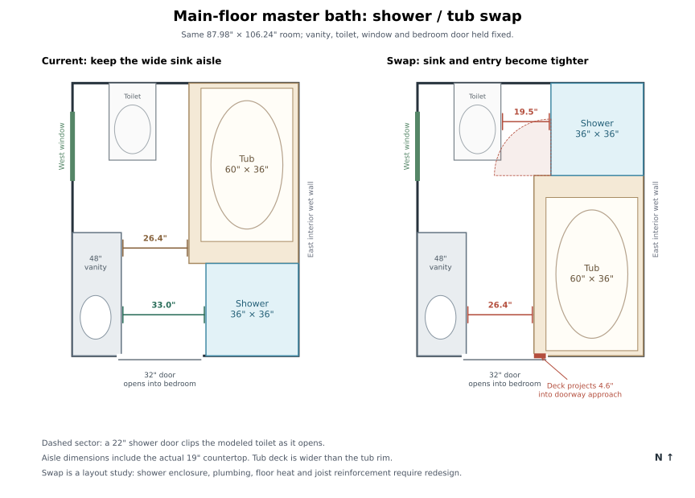

# Main-floor master bathroom: shower / tub swap study

Investigated 2026-10-09. **Recommendation: keep the current arrangement with the selected
Kohler 60" × 36" drop-in tub.** Swapping the bathing fixtures fits their footprints into
the room, but puts the wider tub deck opposite the basin and against the bedroom doorway.
The north shower also acquires a tight entrance beside the toilet. The benefits are a
more secluded shower and potentially easier tub servicing; they do not outweigh the
circulation losses for these fixtures.

## Basis and measured comparison

Loaded `houses/catlin` from source and resolved it with `typehaus.resolve.resolve`.
The alternative reflects the east bathing block north/south inside the existing room;
the vanity, countertop, toilet, exterior window and bedroom door stay in their current
positions. Either tub head/foot orientation has the same circulation result. This is a
layout study, with no service rerouting or construction changes adopted.

The finished room is **87.98" × 106.24", 64.91 ft²**. The shower is 36" square, but the
tub's platform occupies **42.615" × 70.24"**. Its rim is only 35.75" × 59.6875"; measuring
circulation to the rim would omit the apron, framing and service space. The vanity has an
18" carcass and an actual 19" countertop, which is the edge used below.

| Measurement | Current: shower south, tub north | Swap: tub south, shower north |
|---|---:|---:|
| Aisle at the basin, measured from countertop | **32.98"** | **26.365"** |
| Aisle at the northern drawer end | 26.365" | 26.365" |
| Unobstructed approach within the modeled 32" doorway span | 32" | **27.365"** |
| Neighbor opposite the shower's west face | Vanity, 32.98" away | **Toilet, 19.49" away** |
| Shower footprint | 36" × 36" | 36" × 36" |
| Window relationship | Window opposite tub | Window opposite shower |

Doorway figures are measured between the modeled jamb positions, before accounting for
the leaf, stops or trim; they are not a claim of a 32" finished clear opening. With the
swap, the tub deck projects **4.635"** across that approach. Immediately inside the room,
the countertop narrows the passage further to the 26.365" aisle.

For a comfort benchmark, NKBA Bathroom Planning Guideline 4 recommends 30" in front of
fixtures. The current basin exceeds that; the swapped basin falls 3.635" short. This is a
planning recommendation, not a finding of a Minnesota code violation.
[NKBA planning guidelines, printed p. 41](https://media.nkba.org/uploads/2022/05/Bath-Planning-Guidelines.pdf).

## What the swap improves

- The daily shower moves farther from the bedroom entrance, with the tub deck in front
  of it. Its second full-height backing wall becomes the hall wall instead of the bedroom
  wall, which could reduce direct shower noise into the bedroom.
- The shower occupies the window's north/south band. The window remains on the west wall,
  so neither arrangement places the tub beneath it.
- A tub service panel at the mirrored foot end could be beyond the vanity's north end,
  opening up working space. The current panel overlaps the drawer end of the vanity in
  plan. This would require its wall attachment and receptacle to be reauthored.

## Why the circulation gets worse

The tub deck is **6.615" wider than the shower**. Moving it south takes that full amount
from the basin aisle. Its 70.24" length then faces all 48" of vanity, so reversing the
basin and drawer ends would not restore the wider standing space.

The north shower's entrance has to face west: the north and east sides are room walls,
and the tub deck occupies its south side. Across most of that west face the toilet is
only 19.49" away. There is just 6" of shower frontage south of the toilet's footprint.
A hypothetical **22" pivot door hinged at the shower's south-west corner intersects the
modeled toilet footprint during its outward sweep**, even though its fully open position
misses the bowl. The dashed sector in the drawing shows this experiment. The house does
not currently author an enclosure or door for this shower, so its actual door selection
would still need evaluation. This is a geometric conflict for that pivot configuration,
not a blanket conclusion that every enclosure fails.

Sliding or folding glass might solve the door sweep, but would retain the tight standing
space beside the toilet. Moving the toilet approximately 4.5" west would give roughly
24" there; that would be an additional plumbing change and would leave the narrow basin
aisle untouched.

## Construction consequences

Both fixtures remain beside an interior wet wall, so there is no evident reason to move
the main stack solely for this swap. There is also no demonstrated plumbing saving:
`PR-B-SH2-DRAIN` is 2", `PR-B-TUB2-DRAIN` is 1½", and their branch paths, floor penetrations
and connection to `PR-M-BATH2-VENT` need separate redesign. The explicit fixture drain
coordinates are routing anchors; notably, the shower's current anchor is outside its pan,
so retaining those coordinates after moving the fixtures would not establish a real
rough-in layout.

The tub's access panel, Bask receptacle and electrical connection must follow the deck.
Kohler requires a GFCI-protected 120 V / 15 A service and its included drop-in template;
the current provisional cutout is not a manufacturer dimension that can simply be reused
as a final shop drawing.
[Kohler K-5713-W1 specification, p. 2](https://resources.kohler.com/webassets/kpna/catalog/pdf/en/K-5713-W1_spec_US-CA_Kohler_en.pdf).

The knee wall shared by the shower and deck changes sides, the deck cap and opening move,
and shower finish spans and backing move from `W-M-BA2E2` / `W-M-BDN1` to the north/east
walls. The finished apron thickness must be included when refining the narrow aisle.

The tub's blocking and sister placement in `params/main_deck.py` would need review for
the southern bays. The current northern sister also serves the WashTower, so moving the
tub reinforcement wholesale would discard a support benefit the laundry relies on.
The tub remains transverse to the joists; moving it does not itself establish a need
for a new beam or foundation support.

The existing 17.52 ft² floor-heat zone overlaps **0.58 ft² of the moved tub platform** and
must be redrawn with its keepouts. A simple planar calculation with the same 2" wall,
cabinet, shower and platform setbacks and 7" toilet-drain setback leaves about 20.20 ft²
of potential heated floor in either arrangement. Thus the swap provides no inherent
heating-area gain or loss; the zone changes shape. Heat delivery remains the separate
question already documented in `room_heat_loss_baths.md`.

## What would make another swap study worthwhile

A narrower tub or a substantially slimmer platform, together with a revised shower
entrance/toilet position, could change the result. To preserve 30" at the existing
countertop, the southern platform would have to be **no wider than 38.98"**; to clear
the entire modeled doorway span it would have to be **no wider than 37.98"**. The current
42.615" platform cannot meet either target by merely exchanging positions.

If keeping the chosen 36" Kohler is the priority, the current arrangement gives the
better daily use of the sink and shower. If a secluded north shower is the priority,
treat the alternative as a broader bathroom redesign that also revisits the tub/deck,
toilet and entry.

## Verification

Both layouts were resolved from independent plan snapshots, and dimensions were checked
against transformed footprints, wall finish faces and the resolved countertop. The
alternative fits the bathing footprints inside the room, with unchanged platform area.
Neither resolve reported a new bathroom placement finding. That does not validate the
enclosure, doorway passage or services: the shower type has no authored entrance
clearance, and the platform is construction rather than a fixture footprint.

The existing bathroom regression modules passed: **28 tests** across
`test_catlin_bath2_tub_deck.py` and `test_catlin_bath2_vanity_heat_and_joists.py`, run with
`.venv/bin/python -m pytest <both modules> -q -n 0`. These validate the current design;
the alternative has only the layout measurements and pivot-sweep experiment above.
Generated study inputs and measurements are in the local, ignored
`houses/catlin/out/bath2-swap-review/` directory.
